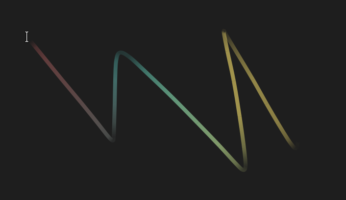

# Mouse Tail
A Gnome extension to draw the mouse tail on the screen



## Profiles

All settings are managed through condition-based profiles, like CSS rules.
Each profile has optional conditions (system light/dark style, workspace,
time of day, focused application's `wm_class`) and a patch of trail settings.

- Profiles with more active conditions take priority; ties are broken by
  list position (later wins).
- Options left unset in a profile fall through to lower-priority rules,
  ending at the built-in Default profile and factory defaults.
- Settings migrate automatically from older flat versions on first run.

## Development

```sh
./compile-schemas.sh                # compile the GSettings schema locally
node tests/test-profile-engine.mjs   # unit tests for the shared profile engine
gjs -m tests/integration-test.mjs    # integration test (schema + engine, in-memory dconf)
po/update-pot.sh                     # regenerate the translation template
po/compile-locales.sh                # compile po/*.po into locale/ (runtime translations)
./package.sh                         # build mouse-tail.zip for extensions.gnome.org
```